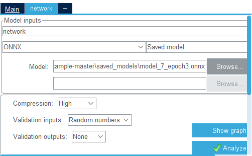

# TinyRunners
This repository stores the codes for joining the 2022 TinyML Design Contest @ ICCAD

## Contents

[1. Training](README.md#training)

[2. C codes for deployment](README.md#c-codes-for-deployment)

[3. How to test our model](README.md#How-to-test-our-model)


## Training

Training repository can alse be seen here:

[https://github.com/jingye-xu/TinyRunners](https://github.com/jingye-xu/TinyRunners)

### Data Preparation

`data` folder stores the compressed `data.gz` file that stores all data.

There are also some functions that can be called individually to help analyze to dataset.

### Model design
Model design and model structure is stored inside `NN/model/`

Besides, the dataload function for training using pytorch stores here.

### Training

To train the model, make sure you are in the root path of this repository, and run command:

```bash
python NN/train.py
```

### Logging and saved model

logging files and saved model are stored at lightning_logs, you can easily use tensorboard to read the logs.

**Note**: This repository does not store any pre-trained model, the pre-trained model will be submitted along with this repository.

## C Codes for deployment

## Ready to deploy

C codes for deployment is stored here: 

[https://github.com/jingye-xu/TinyRunners-C-code](https://github.com/jingye-xu/TinyRunners-C-code)

## Build your own

1. Follow the official instructions to build the C code: 
[Cube-AI](https://github.com/tinymlcontest/tinyml_contest2022_demo_example/blob/master/README-Cube.md)

2. When adding our model, please select "Compression" to "high"


3. Generate code

## How to test our model

1. Refer to evaluation repository provided by TinyML Contest committe:
[demo evaluation](https://github.com/tinymlcontest/tinyml_contest2022_demo_evaluation)

2. Use "validation.py" to validate the model after deploying. Please make sure select the correct serial port.
